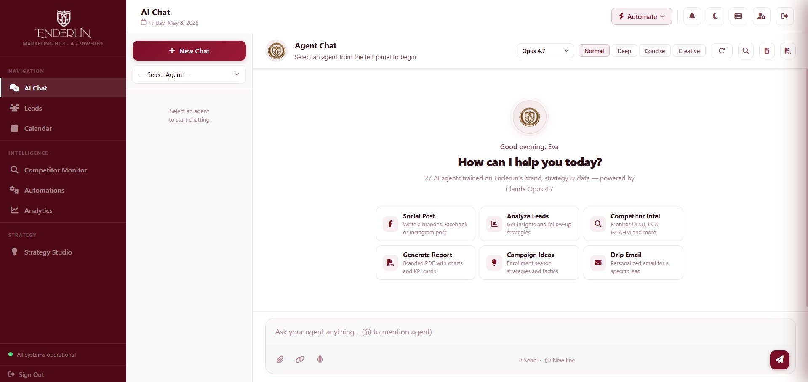
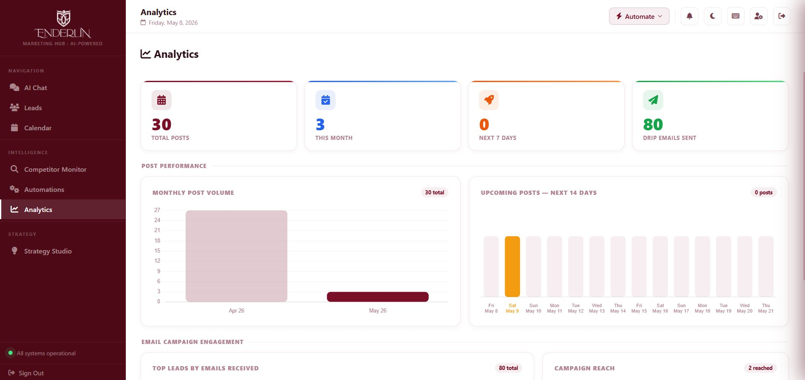
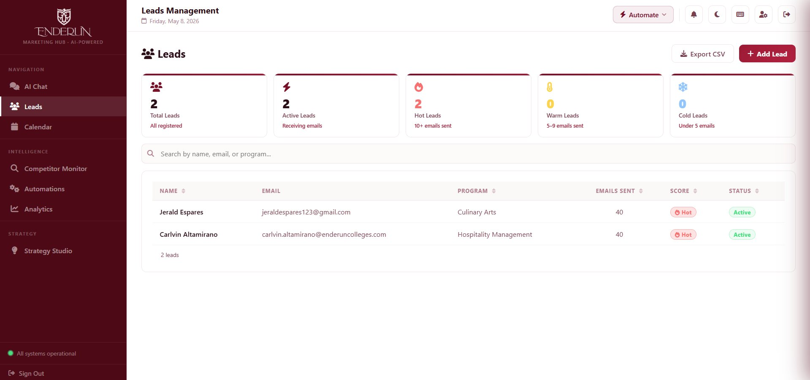
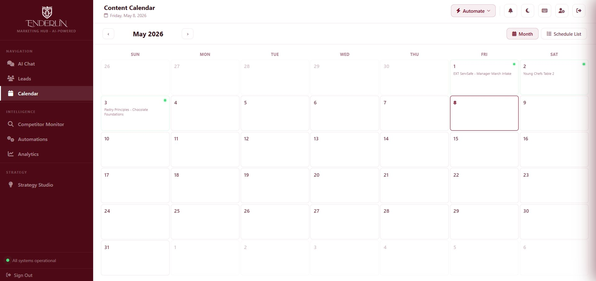
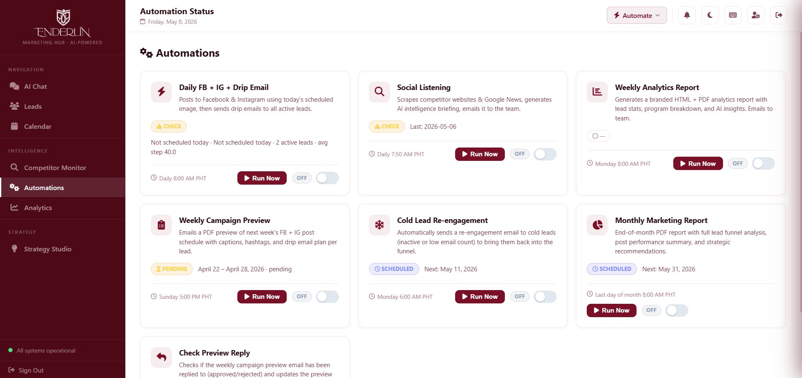
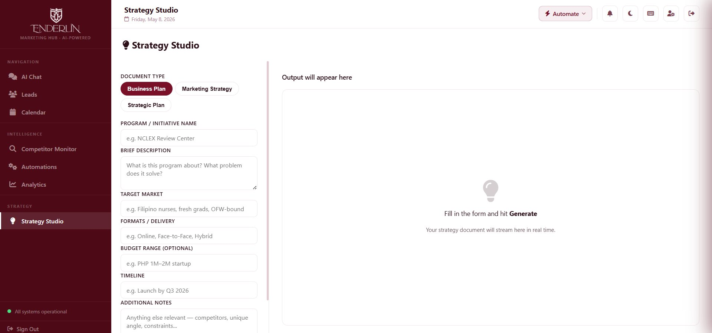
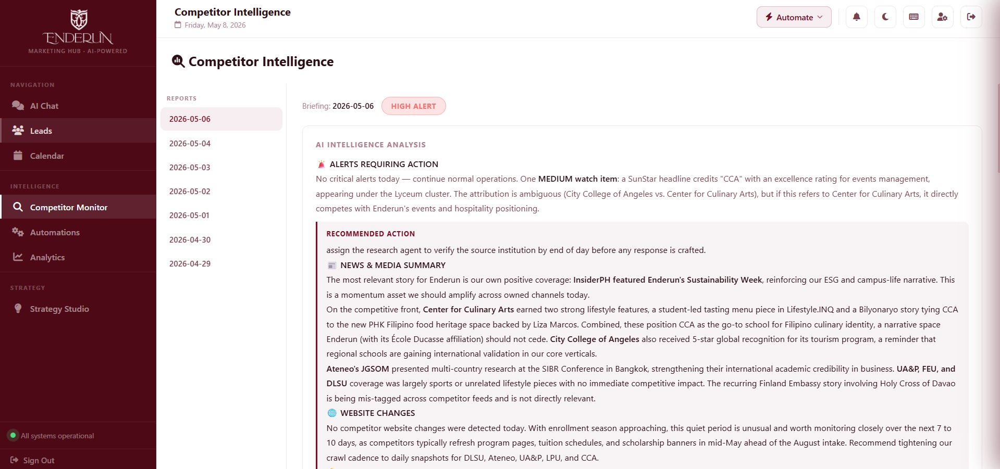
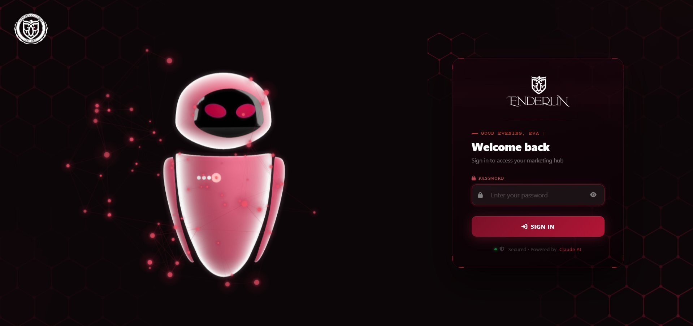

# Eva — AI Marketing Operations System for Enderun Colleges

> A 28-agent AI marketing department running on Claude Opus 4.7 — automating social posting, drip email, competitor intelligence, lead nurture, and weekly reporting for **Enderun Colleges** (Manila, Philippines).

This repository is a portfolio showcase of a production AI marketing system built end-to-end: 28 specialized agents, a live web dashboard, an always-on Telegram assistant, GitHub Actions automation, and a custom branded PDF reporting engine.

---

## What This System Does

Every day at 8AM PHT, without anyone touching a laptop:

1. **Posts to Facebook** — fresh AI-generated caption, image pulled from Google Drive
2. **Posts to Instagram** — same image, different caption optimized for IG (more hashtags, lifestyle tone)
3. **Sends drip emails** to every active lead — personalized HTML email based on their position in the sequence
4. **Scrapes competitor websites + Google News** — detects changes, summarizes intelligence, emails the team
5. **Sends Telegram briefing** to the marketing manager — what ran, what failed, what's next

Every Sunday 5PM, the system emails a branded PDF preview of the week's posts and drip emails. The team can reply "approve" or "make these changes" — Eva regenerates and resends until approved.

Every Monday 8AM, a weekly analytics PDF lands in inboxes with KPI cards, charts, AI insights, and program-level lead breakdowns.

Eva (the Telegram bot) runs 24/7 on Railway. You can talk to her in English or Filipino, send her voice messages, ask her to scan crypto signals, or trigger any workflow with natural language: *"send drip emails to all leads"* or *"post to Facebook now"*.

---

## Screenshots

| Dashboard — AI Chat | Dashboard — Analytics |
|---|---|
|  |  |

| Dashboard — Leads | Dashboard — Calendar |
|---|---|
|  |  |

| Dashboard — Automations | Dashboard — Strategy Studio |
|---|---|
|  |  |

| Dashboard — Competitor Intel | Dashboard — Login |
|---|---|
|  |  |

---

## Architecture

```
┌──────────────────────────────────────────────────────────────────┐
│                    USER INTERFACES                               │
│  ┌──────────────┐   ┌──────────────────┐   ┌──────────────┐      │
│  │ Web Dashboard│   │  Telegram (Eva)  │   │ Email/PDFs   │      │
│  │  Flask:8080  │   │   Always-on bot  │   │ Inbox actions│      │
│  └──────┬───────┘   └────────┬─────────┘   └──────┬───────┘      │
│         │                    │                    │              │
└─────────┼────────────────────┼────────────────────┼──────────────┘
          │                    │                    │
┌─────────▼────────────────────▼────────────────────▼──────────────┐
│                   ORCHESTRATION LAYER                            │
│   28 specialized agents (Claude Opus 4.7) — each a .md prompt    │
│   • marketing-manager (coordinator)                              │
│   • chief-strategist (approver)                                  │
│   • social-media, pr, drip-campaign, designer, data-analysis     │
│   • competitor-analysis, content-strategy, seo-digital           │
│   • + 20 more specialists                                        │
└─────────┬────────────────────┬────────────────────┬──────────────┘
          │                    │                    │
┌─────────▼────────────────────▼────────────────────▼──────────────┐
│                    AUTOMATION LAYER                              │
│  GitHub Actions (cron-job.org dispatch) — runs even with laptop  │
│  ┌──────────────┐  ┌──────────────┐  ┌──────────────┐            │
│  │ Daily 8AM    │  │ Sun 5PM      │  │ Mon 8AM      │            │
│  │ FB + IG +    │  │ Weekly       │  │ Weekly       │            │
│  │ Drip Email   │  │ Preview PDF  │  │ Analytics    │            │
│  └──────────────┘  └──────────────┘  └──────────────┘            │
│  ┌──────────────┐  ┌──────────────┐  ┌──────────────┐            │
│  │ Daily 7:50AM │  │ Daily 9AM    │  │ Reply Poller │            │
│  │ Social       │  │ Competitor   │  │ Sun 7PM →    │            │
│  │ Listening    │  │ Alert        │  │ Mon 7AM      │            │
│  └──────────────┘  └──────────────┘  └──────────────┘            │
└─────────┬────────────────────┬────────────────────┬──────────────┘
          │                    │                    │
┌─────────▼────────────────────▼────────────────────▼──────────────┐
│                     INTEGRATIONS                                 │
│  Anthropic Claude • Google Drive • Gmail (SMTP+IMAP) •           │
│  Zapier (FB+IG) • imgBB CDN • DuckDuckGo Search •                │
│  Playwright Chromium • Groq Whisper • edge-tts • ccxt (Binance)  │
└──────────────────────────────────────────────────────────────────┘
```

---

## The 28 Agents

Each agent is a markdown prompt file in [agents/](agents/) that defines a role, expertise, output format, and brand voice. The dashboard's "AI Chat" page lets you talk to any of them; the Telegram bot can dispatch tasks to them via `/agent <name>`.

**Coordinator (start here):**
- [marketing-manager](agents/marketing-manager.md) — orchestrates campaigns, suggests new agents
- [chief-strategist](agents/chief-strategist.md) — approves/rejects/improves any proposal

**Core:**
- [social-media](agents/social-media.md), [pr](agents/pr.md), [drip-campaign](agents/drip-campaign.md), [designer](agents/designer.md)
- [data-analysis](agents/data-analysis.md), [content-strategy](agents/content-strategy.md), [seo-digital](agents/seo-digital.md)
- [competitor-analysis](agents/competitor-analysis.md), [social-listening](agents/social-listening.md)

**Specialist:**
- [admissions](agents/admissions.md), [video-multimedia](agents/video-multimedia.md), [events-activations](agents/events-activations.md)
- [alumni-relations](agents/alumni-relations.md), [influencer-kol](agents/influencer-kol.md), [marketing-analysis](agents/marketing-analysis.md)
- [business-analyst](agents/business-analyst.md), [events-banquetes](agents/events-banquetes.md), [researcher](agents/researcher.md)

**Growth & Conversion:**
- [lead-generation](agents/lead-generation.md), [community-manager](agents/community-manager.md), [parent-engagement](agents/parent-engagement.md)
- [whatsapp-sms](agents/whatsapp-sms.md), [enrollment-tracker](agents/enrollment-tracker.md), [blog-seo-content](agents/blog-seo-content.md)
- [testing](agents/testing.md), [crypto-trader](agents/crypto-trader.md)

---

## Notable Components

### `report_helper.py` — Branded PDF Reporting Engine
A reusable PDF builder used by every analytics agent. Light-brown professional theme with KPI cards, styled tables, alert boxes, bar/line/pie charts, two-column layouts, and auto-generated data source citations.

```python
from report_helper import ReportBuilder
rb = ReportBuilder(agent_id="data-analysis", report_title="Lead Funnel Analysis")
rb.add_kpi_row([("Total Leads", "142", False), ("Active", "89", True), ("Rate", "63%", False)])
rb.add_bar_chart("Leads by Program", labels=[...], values=[...], color="brown")
rb.add_alert_box("Enrollment is 20% below target.", level="critical")
rb.save()  # → output/data-analysis/2026-05-09_lead-funnel-analysis.pdf
```

### `telegram_bot.py` — Eva (Always-On Marketing Assistant)
40+ slash commands. Voice in/out (Groq Whisper + edge-tts). PDF analyzer. Browser automation via Playwright. DuckDuckGo web search. Natural-language workflow triggering. Hosted on Railway 24/7.

### `weekly_campaign_preview.py` — Weekly Approval Loop
Sunday 5PM: emails a branded 3-page PDF preview to the team with FB/IG post schedule, drip email queue per lead, and hashtag sets. Recipients reply "approve" or "change X" — `check_preview_reply.py` polls Gmail every 2 hours, regenerates with Claude, and sends a v2/v3 PDF until approved.

### `social_listening.py` — Competitor Intelligence
Hashes competitor pages daily and detects changes. Pulls Google News from the last 7 days. Sends an HTML-rendered intelligence briefing email with bold markdown converted to inline styles.

### `dashboard.py` — Web Dashboard (Flask, single-file)
~10K lines. Stats, leads CRUD, drip schedule, notification bell, AI chat with streaming, agent runner, AI image generation, calendar, strategy studio, competitor intel viewer.

### `paper_trading.py` + `trading_engine.py` — Crypto Signal Scanner
Auto-scans Binance every 15 min for SMC/Wyckoff/ICT setups. Paper portfolio with SL/TP auto-close, win-rate tracking, Telegram alerts. Bonus module — Eva's optional side hustle.

---

## Tech Stack

- **AI:** Anthropic Claude Opus 4.7 (`claude-opus-4-7`) for all generation, classification, and reasoning
- **Backend:** Python 3.11, Flask, python-telegram-bot
- **Hosting:** Railway (Telegram bot 24/7), GitHub Actions (cron jobs)
- **Storage:** Google Drive (images), Google Sheets (lead sync), CSV (leads)
- **Email:** Gmail SMTP (outbound) + IMAP (reply polling)
- **Social:** Zapier webhooks → Facebook Pages + Instagram for Business
- **Image hosting:** imgBB (Instagram needs public CDN URLs)
- **Reporting:** ReportLab (PDF), matplotlib (charts), Jinja-style HTML email
- **Voice:** Groq Whisper (transcription), edge-tts (TTS — Jenny English, Blessica Filipino)
- **Browser automation:** Playwright Chromium
- **Trading (bonus):** ccxt, pandas-ta, Binance public API

---

## Setup

```bash
# 1. Clone
git clone https://github.com/<your-username>/eva-marketing-ai-showcase.git
cd eva-marketing-ai-showcase

# 2. Install
pip install -r requirements.txt
playwright install chromium  # only if using browser automation

# 3. Configure
cp .env.example .env
# fill in: ANTHROPIC_API_KEY, GMAIL_ADDRESS, GMAIL_APP_PASS, etc.

# 4. Run dashboard
python dashboard.py
# open http://localhost:8080

# 5. Run Telegram bot (optional)
python telegram_bot.py
```

For cloud automation (GitHub Actions), add the same `.env` keys as repo Secrets in your fork's settings, then **copy `github-workflows-templates/*.yml` into `.github/workflows/`** in your fork — they'll activate automatically. (They live in a templates folder here so the showcase can be pushed without needing `workflow` scope on the PAT.)

---

## What I Built (Highlights)

- **Multi-agent orchestration** — 28 single-prompt agents that compose into campaigns via a coordinator
- **Reply-driven approval loop** — humans iterate by replying to emails; Claude reads the reply and regenerates
- **Cross-platform posting** — same image, two captions (FB warm/community, IG aspirational/lifestyle)
- **Branded reporting at scale** — every agent ships PDFs with consistent typography, colors, and source citations
- **Always-on bilingual assistant** — Filipino + English voice in/out; intent-based workflow triggering
- **Full self-recovery** — if a workflow fails, Telegram notifies; if a reply is unclear, Eva asks for clarification

---

## Project Context

Enderun Colleges is a premium private higher-education institution in BGC, Manila — partnered with **Les Roches** (Switzerland) and **École Ducasse** (France). The marketing team manages three business units:

1. **Enderun Colleges** — main campus (Hospitality, Culinary, Business, Tourism, Architecture, Real Estate, MBA)
2. **Enderun Extension** — continuing education (WSET, ServSafe, certificates)
3. **Enderun Events / Banquetes** — premium event venue and catering at McKinley Hill, BGC

This system was built to give a small marketing team the leverage of a 30-person agency.

---

## License

This is a portfolio showcase. Code is published for review and learning. Real automation runs on a private production repo — this public mirror has anonymized lead data and no live credentials.

---

## Contact

Built by the Enderun Marketing team.
For questions, reach out via the contact info on https://www.enderuncolleges.com.
